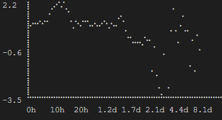

# Vädret i Stockholm

Exempelprojekt i Rust som visar aktuellt väder. Anropar SMHIs väder-api. Position hämtas med hjälp as windows positions-api.

`cargo run`

SMHI:s 10-dagarsprognos presenteras:

